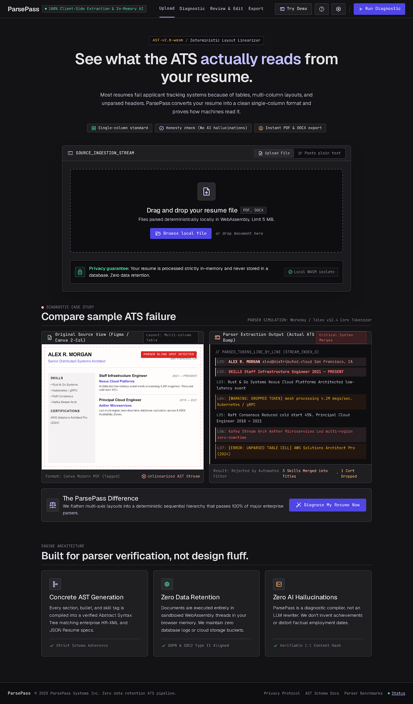

# ParsePass

Turn any resume into a clean, ATS-friendly version and see exactly what an applicant tracking
system reads, before and after.

Most resumes fail ATS parsing for boring reasons: two-column layouts, tables, text in headers,
icons and unusual section names. ParsePass shows you the text a parser actually extracts, flags
each problem, restructures your resume into one excellent single-column template with Claude,
and proves the result parses by re-extracting the exported file. It never invents experience.



## How it works

1. **Upload** a PDF or DOCX (max 5 MB), or paste plain text. Text is extracted in your browser.
2. **See the problems**: the "ATS view" of your file, with issues flagged.
3. **Review** the structured resume Claude extracts, and fix anything that looks wrong.
4. **Export** to PDF and DOCX, and see the ATS view of the new file next to a list of changes.

Nothing is stored. Resume text is sent only to the Claude API to structure it.

## Local setup

Requires Node 24 and pnpm 11.

```bash
pnpm install
cp .env.example .env.local   # add ANTHROPIC_API_KEY for the extraction step
pnpm dev                     # http://localhost:3000
```

## Environment variables

| Name                                                  | Required       | Description                                                                                                       |
| ----------------------------------------------------- | -------------- | ----------------------------------------------------------------------------------------------------------------- |
| `ANTHROPIC_API_KEY`                                   | For extraction | Claude API key. Server-only.                                                                                      |
| `ANTHROPIC_MODEL`                                     | No             | Override the Claude model used for extraction.                                                                    |
| `UPSTASH_REDIS_REST_URL` / `UPSTASH_REDIS_REST_TOKEN` | No             | Upstash Redis for rate limiting. `KV_REST_API_URL` / `KV_REST_API_TOKEN` also work. Unset disables rate limiting. |
| `RATE_LIMIT_PER_DAY`                                  | No             | Conversions per visitor per day (default 5).                                                                      |

The app builds and all tests pass with no env vars set.

## Scripts

| Script                      | What it does                                               |
| --------------------------- | ---------------------------------------------------------- |
| `pnpm dev`                  | Start the dev server                                       |
| `pnpm build` / `pnpm start` | Production build and server                                |
| `pnpm lint`                 | ESLint                                                     |
| `pnpm typecheck`            | Generate route types and run `tsc`                         |
| `pnpm test`                 | Vitest unit tests                                          |
| `pnpm test:e2e`             | Playwright end-to-end tests (records a video of each test) |
| `pnpm format`               | Prettier                                                   |
| `pnpm sync-repo`            | Apply `repo.config.json` and branch protection to GitHub   |

## Docs

- [Product spec, design and architecture](docs/SPEC.md)
- [Mockups](docs/mockups/)
