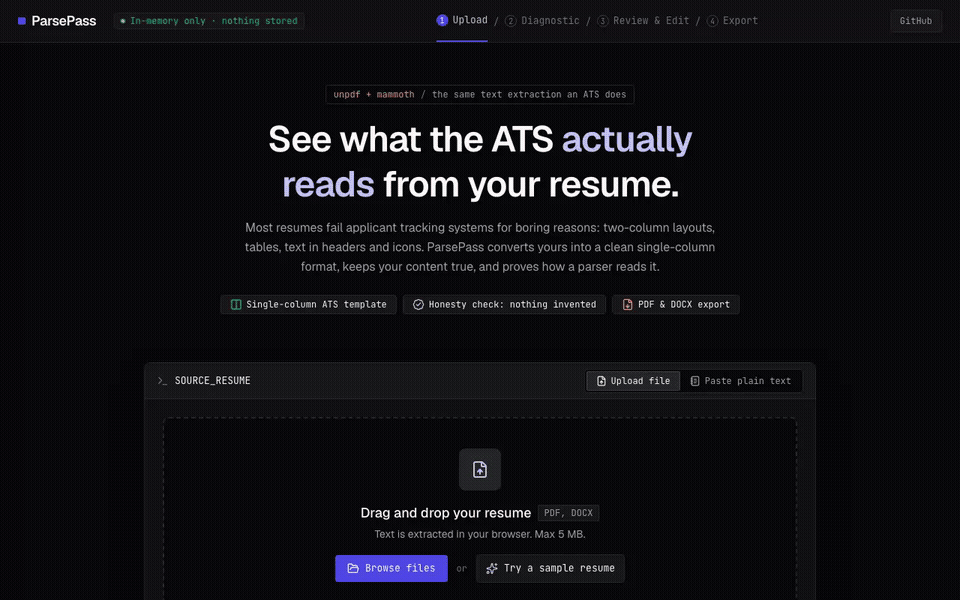
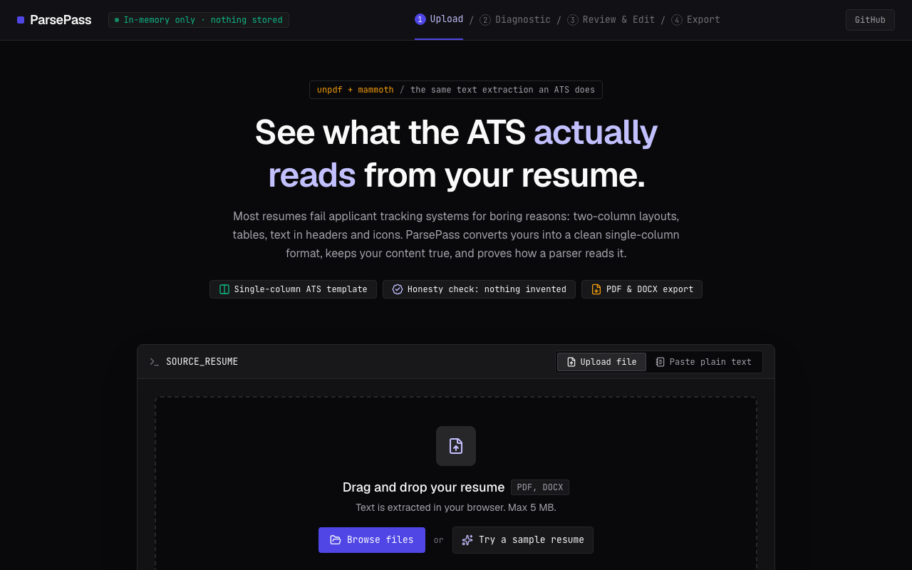
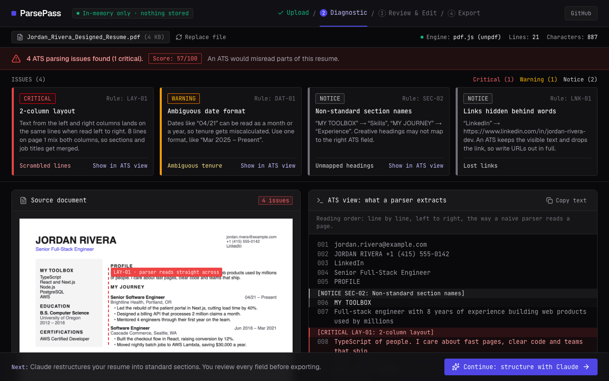
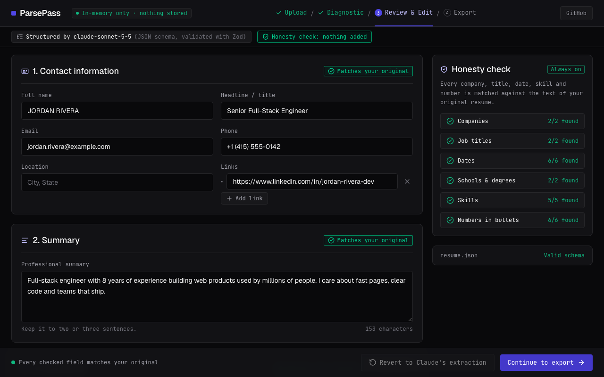
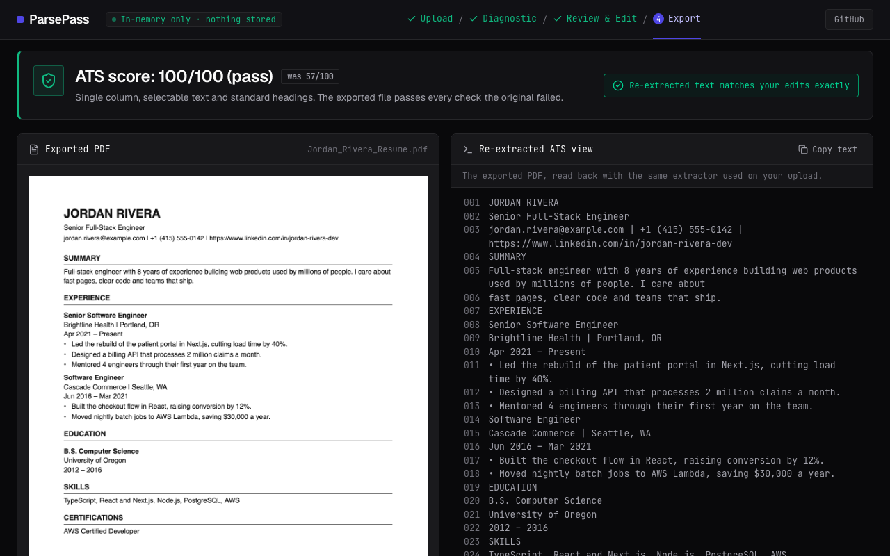

# ParsePass

Turn any resume into a clean, ATS-friendly version and see exactly what an applicant tracking
system reads, before and after.



Most resumes fail ATS parsing for boring reasons: two-column layouts, tables, text in page
headers, icons and unusual section names. Job seekers can't see this, so they never know why they
get no replies. ParsePass shows the text a parser actually extracts, flags every problem,
restructures the resume into one excellent single-column template with Claude, and proves the
result parses by reading the exported file back. It never invents experience.

## How it works

| 1. Upload                                                                                                                                      | 2. See the problems                                                                                                                                                |
| ---------------------------------------------------------------------------------------------------------------------------------------------- | ------------------------------------------------------------------------------------------------------------------------------------------------------------------ |
|                                                                                                        |                                                                                                                    |
| PDF or DOCX (max 5 MB), or paste text. Text is extracted **in your browser** with pdf.js and mammoth, the same kind of extraction an ATS does. | The "ATS view": the file's text read line by line, left to right, like a naive parser. Issues are flagged with a rule ID, severity and plain-language explanation. |

| 3. Review what Claude extracted                                                                                                                                                       | 4. Export with proof                                                                                                                                                 |
| ------------------------------------------------------------------------------------------------------------------------------------------------------------------------------------- | -------------------------------------------------------------------------------------------------------------------------------------------------------------------- |
|                                                                                                                                               |                                                                                                                              |
| Claude restructures the text into contact, summary, experience, education and skills. Every company, title, date, skill and number is checked against the original, live as you edit. | Download PDF (selectable text) and DOCX. The exported PDF is re-extracted with the same code, re-scored, and compared to your edits, next to a list of every change. |

### Issues it detects

| Rule                | What                                                         |
| ------------------- | ------------------------------------------------------------ |
| `TXT-01`            | Image-only PDF: no selectable text at all                    |
| `LAY-01`            | Multi-column layout that interleaves when read left to right |
| `LAY-02`            | Content in tables (DOCX) or table-like grids (PDF)           |
| `LAY-03`            | Text boxes and images (DOCX)                                 |
| `HDR-01`            | Contact details in the page header or footer                 |
| `CON-01`            | No email address an ATS can read                             |
| `ICO-01`            | Icons, emoji and icon fonts                                  |
| `SEC-01` / `SEC-02` | Missing sections; creative headings like "My Toolbox"        |
| `DAT-01`            | Mixed or ambiguous date formats (`04/21`)                    |
| `LNK-01`            | Links hidden behind words like "LinkedIn"                    |

### Tailor it to a job

- **Job match:** paste a job description. The model lists the skills and keywords it asks for;
  ParsePass does the matching itself, so the score is repeatable and updates as you edit. It
  shows what's covered and what's missing, and never adds a keyword for you.
- **Stronger bullets:** suggested rewording for each role, shown as a diff you accept or dismiss.
  Suggestions that add a number or a named tool, company or product that isn't on your resume are
  thrown out in code before you see them.

## Honesty and privacy

- **Claude restructures, it doesn't write.** The prompt forbids adding companies, titles, dates,
  numbers or skills. Then the code checks: anything in the output that isn't in the source text
  is flagged next to the field ([`src/lib/resume/honesty.ts`](src/lib/resume/honesty.ts)).
- **Structured output.** Extraction uses `claude-sonnet-5-5` with structured outputs built from
  a Zod schema, and the result is validated with Zod again before use.
- **Nothing is stored.** No database. The file never leaves the browser: only its extracted text
  goes to `/api/extract`, which forwards it to the Claude API and keeps nothing. The edited
  resume lives in the browser session until you download it. Logs hold token counts and error
  types, never resume text.
- **Rate limited.** A few conversions per visitor per day (Upstash Redis, keyed by a hash of the IP).

## Stack

Next.js 16 (App Router) · TypeScript · Tailwind CSS v4 + shadcn/ui · unpdf (pdf.js) and mammoth
for text extraction · Claude API via the Anthropic TypeScript SDK · Zod · @react-pdf/renderer and
docx for export · Upstash Redis · Vitest and Playwright · Vercel.

Design: the "Technical Parser Minimal" system from the Stitch mockups in
[`docs/mockups/`](docs/mockups/). Spec, architecture notes and milestones: [`docs/SPEC.md`](docs/SPEC.md).

## Local setup

Requires Node 24 and pnpm 11.

```bash
pnpm install
cp .env.example .env.local   # add ANTHROPIC_API_KEY for the extraction step
pnpm dev                     # http://localhost:3000
```

Upload and the diagnostic work without any keys. Structuring the resume (and so review and export)
needs a model: `ANTHROPIC_API_KEY` for Claude, or `GEMINI_API_KEY` for Gemini's free tier.

## Environment variables

| Name                                                  | Required              | Description                                                                                                                                                                               |
| ----------------------------------------------------- | --------------------- | ----------------------------------------------------------------------------------------------------------------------------------------------------------------------------------------- |
| `ANTHROPIC_API_KEY`                                   | For extraction        | Claude API key. Server-only.                                                                                                                                                              |
| `ANTHROPIC_MODEL`                                     | No                    | Override the extraction model (default `claude-sonnet-5-5`).                                                                                                                              |
| `GEMINI_API_KEY`                                      | Alternative to Claude | Google Gemini free-tier key. Used when no Anthropic key is set (or `EXTRACTION_PROVIDER=gemini`). Google may use free-tier content to improve its products, and the privacy note says so. |
| `GEMINI_MODEL`                                        | No                    | Override the Gemini model (default `gemini-3.5-flash`).                                                                                                                                   |
| `EXTRACTION_PROVIDER`                                 | No                    | `anthropic` or `gemini`, to choose explicitly when both keys are set.                                                                                                                     |
| `UPSTASH_REDIS_REST_URL` / `UPSTASH_REDIS_REST_TOKEN` | For rate limiting     | Upstash Redis. `KV_REST_API_URL` / `KV_REST_API_TOKEN` (set by the Vercel Marketplace integration) also work. Unset disables rate limiting.                                               |
| `RATE_LIMIT_PER_DAY`                                  | No                    | Conversions per visitor per day (default 5).                                                                                                                                              |
| `RATE_LIMIT_ASSIST_PER_DAY`                           | No                    | Job keyword checks and bullet suggestions per visitor per day (default 20).                                                                                                               |

The app builds and all tests pass with no env vars set.

## Deploying to Vercel

1. Import the repo in Vercel (framework: Next.js).
2. Add **Upstash for Redis** from the Vercel Marketplace to the project; it sets the
   `KV_REST_API_*` variables.
3. Add `ANTHROPIC_API_KEY`, and set a monthly spend limit in the Anthropic Console.
4. Put the production URL in `repo.config.json` → `homepage` and run `pnpm sync-repo`.

## Scripts

| Script                       | What it does                                                                                        |
| ---------------------------- | --------------------------------------------------------------------------------------------------- |
| `pnpm dev`                   | Start the dev server                                                                                |
| `pnpm build` / `pnpm start`  | Production build and server                                                                         |
| `pnpm lint` / `pnpm format`  | ESLint / Prettier                                                                                   |
| `pnpm typecheck`             | Generate route types and run `tsc`                                                                  |
| `pnpm test`                  | Vitest unit tests (ATS checks, honesty check, extraction, export round trip)                        |
| `pnpm test:e2e`              | Playwright end-to-end tests against a mock Claude API; records a video of each test                 |
| `pnpm fixtures`              | Regenerate the resume fixtures in `tests/fixtures` and the sample resume                            |
| `pnpm eval:extract <folder>` | Run every PDF/DOCX in a folder through the configured model and report what the honesty check flags |
| `pnpm demo`                  | Re-record the screenshots and GIF in `docs/demo` (after `pnpm build`)                               |
| `pnpm sync-repo`             | Apply `repo.config.json` and branch protection to GitHub                                            |
